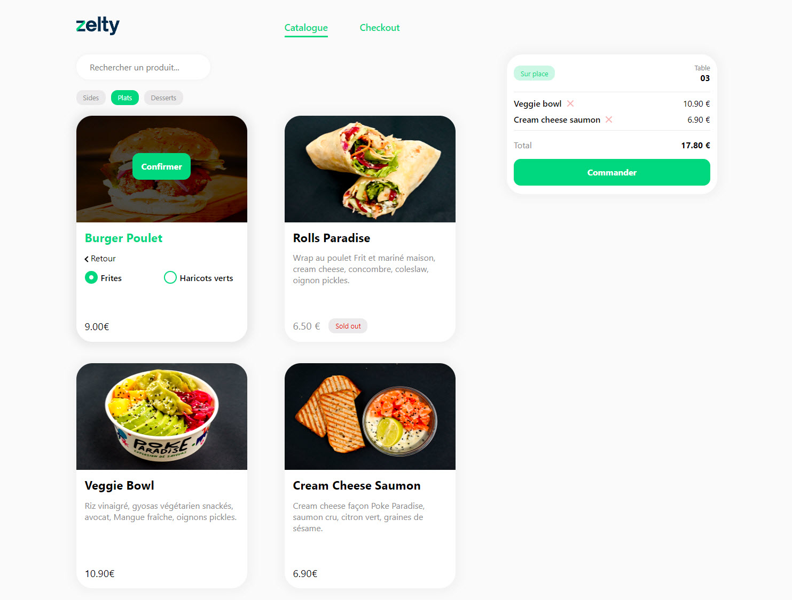
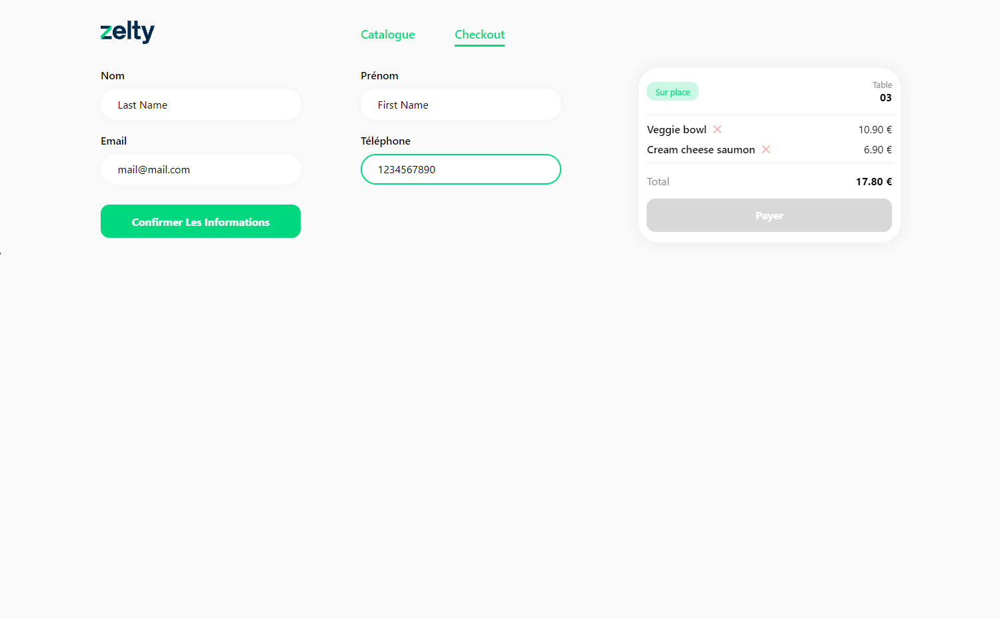

# Zelty
[Zelty](https://food-dinh.vercel.app/) is a modern food ordering app designed for multi-site restaurants, featuring catalogue browsing, checkout, and order management.




## Tech Stack
- React 18
- Redux
- TypeScript
- Vite
- Styled-components
- React Hook Form
- React Testing Library

## Features
- Product catalogue with menu filtering and search
- Option selection for products (sauces, sides)
- Cart management (add, remove, total calculation)
- Checkout with form validation
- Notifications for user actions
- Persistent state with local storage
- Mock data for offline development

## Table of contents
* How to install and Run Zelty application
    * Clone Zelty
    * Install necessary modules
    * Run Zelty
* Zelty application's structure
* How to use Zelty
    * Catalogue
    * Checkout


## How to install and Run Zelty application
### Clone and install
To clone and run this application, you'll need [Git](https://git-scm.com) and [Node.js](https://nodejs.org/en/download/) (which comes with [npm](http://npmjs.com)) installed on your computer. From your command line:

```bash
# Clone this repository
$ git clone https://github.com/Quang-Tuyen-DINH/zelty-food.git

# Go into the directory
$ cd zelty-front-test
```

### Install necessary modules
While in the application directory

```bash
# Install dependencies
$ npm install
```

### Run Zelty
To start the application

```bash
# Run the app
$ npx vite --port 3000
```

## Zelty application's structure
```bash
root/
├─ public/
├─ src/
│  ├─ assets/
│  ├─ components/
│  │  ├─ forms/
│  │  ├─ styles/
│  │  ├─ ui/
│  ├─ features/
│  ├─ pages/
│  ├─ routes/
│  ├─ services/
│  │  ├─ catalogue/
│  │  ├─ checkout/
│  │  ├─ local-storage/
│  ├─ shared/
│  │  ├─ models/
│  ├─ store/
│  ├─ tests/
├─ .env
├─ package.json
├─ tsconfig.json
```

## How to use Zelty
From Landing Page `http://localhost:3000/`, client can access to Catalogue page `http://localhost:3000/catalogue` by clicking the `Catalogue` button in navigation bar

### Catalogue
At the Catalogue page `http://localhost:3000/catalogue`, client will find a categorized list of products in 3 menus: Sides, Main courses and Desserts. Each product card shows the food's image, name, description, price, availability and a "Select" button. In case the food has sauce, client can choose the preferred sauce by clicking the "Choose Sauce" on the card then select the sauce and confirm.

On the right side, client can follow their selected food with the total price, also client can remove the selected product on second thought by clicking the "X" icon next to the selected food's name. Once everything is set, client can proceed order by clicking "Order" button

### Checkout
At the Checkout page `http://localhost:3000/checkout`, client has to fill their first name, last name, email and phone number to be available to pay. Once all informations in the right formats have been collected, client can click the "Pay" button to finish the order.
